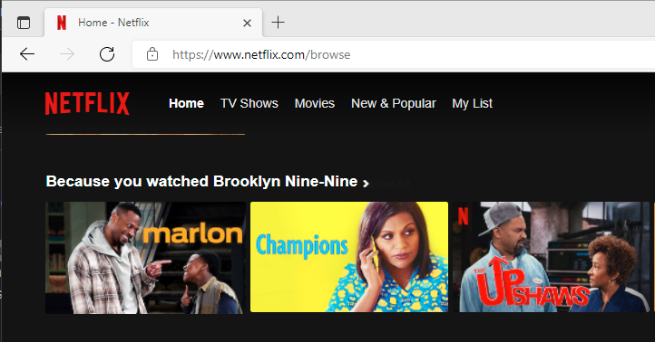
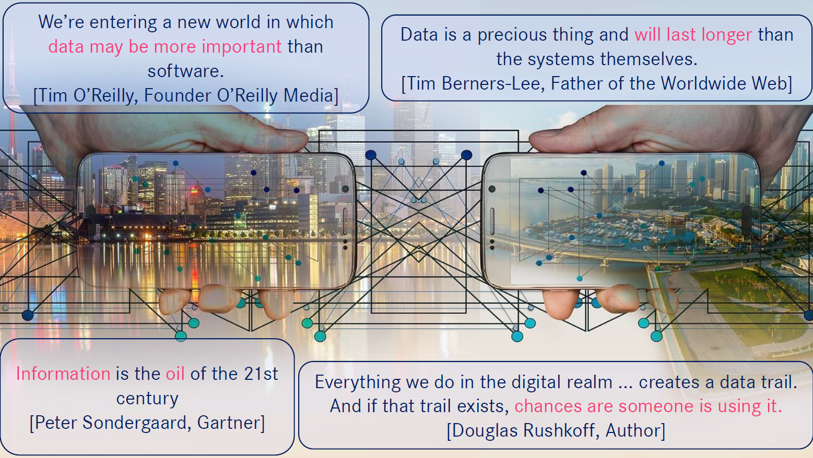

# Neo4j case study: Movie recommendations

Neo4j is an open-source, NoSQL, native graph database. A graph database stores nodes and relationships instead of tables or documents. https://neo4j.com/developer/graph-database/

This Katacoda guides you through creating a graph model for a given dataset, loading data from a CSV file, and utilizing the graph database with different queries. The dataset is sourced from [Kaggle](https://www.kaggle.com/shivamb/netflix-shows) and contains Netflix titles (Bansal, 2022). The original dataset was reduced in size to minimize the loading/computing times in this scenario

The goal of the case study is to import the CSV dataset into the graph database with a suitable schema and perform database queries that allow giving movie recommendations. For example, a user recommendation based on the movie "The Matrix" could list the similar movies "The Matrix Reloaded" and "The Matrix Revolutions" as they are directed by the same people and share the genres and actors.

This case study is inspired by my Netflix homepage, which offers a recommendation based on recent user activity:

 Image: ("Netflix", 2022)

Furthermore, this also shows how user data can be utilized. In general, data is becoming increasingly important in all kinds of applications. This trend is also accepted among well-known industry figures, as shown by the following slide of the Datawarehouse Lecture ("DWH01-IntroDefinition", Slide 5). Everyone agrees that data is incredibly valuable: 
 
Image: (Buckenhofer, 2022)
