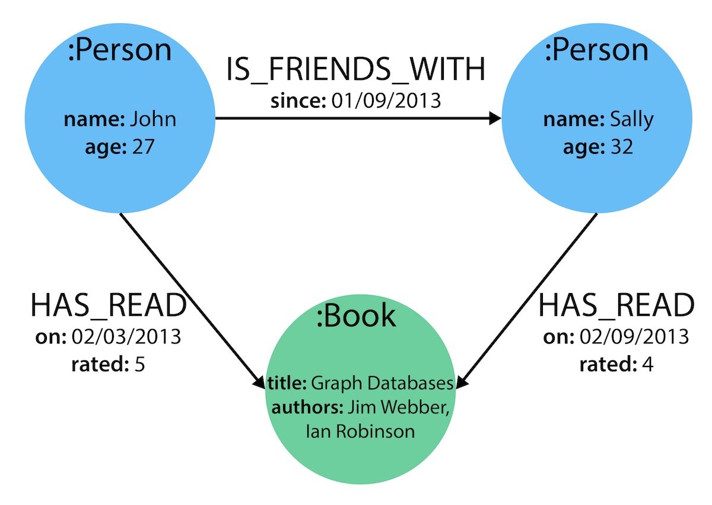

# Neo4j Graph Model

In Neo4j data is represented as labeled property graph. An example of such a graph is given the image below. ("What is a Graph Database? - Developer Guides", 2022)

 Image: ("Graph Modeling Guidelines - Developer Guides", 2022)

The graph in the image consists of:
- Labels:
    - Person (blue nodes)
    - Book (green node)
- Relationships:
    - IS_FRIENDS_WITH
    - HAS_READ
- Properties
    - name, age (Person nodes)
    - title, authors (Book nodes)
    - since (IS_FRIENDS_WITH relationship)
    - on, rated (HAS_READ relationship)

In general, a graph model has the following characteristics (Robinson et al., 2015): 
- It contains nodes and relationships.
- Nodes contain properties (key-value pairs).
- Nodes can be labeled with one or more labels.
- Relationships are named and directed, and always have a start and end node.
- Relationships can also contain properties.

Continue to the next step to learn how to design a graph model based on a given dataset.
