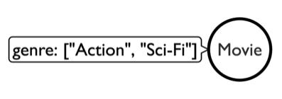
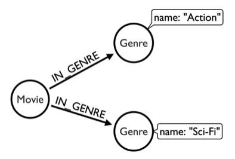

# Designing a graph data model

One way to create a graph data model is to describe the domain in natural language. ("Graph Modeling Guidelines - Developer Guides", 2022)

The dataset used in this scenario lists Netflix titles, including movie/show title, director, cast, and genre. 

You can see all the included information by looking at the column headers of the CSV file. To do so, you can use the command:  
`head -n 1 data/netflix_titles.csv`{{execute}}  

To view the whole file, click on the "CSV File (GitHub)" tab displayed at the top of the terminal. This will open a new tab in you browser and show the full CSV file.  

Focussing on some of the available columns, a possible domain description for this dataset is:
- A movie has an id, title, description, and rating.
- A movie is directed by a director.
- A movie has a cast consisting of multiple actors.
- Actors and directors are persons with a name.
- A movie is listed in multiple genres.

Based on the domain description you can identify the following nodes, properties, and relationships:  
- Nodes/Labels: 
    - Movie
    - Person (Actors and Directors)
    - Genre  
- Properties: 
    - Movie (id, title, description, rating)
    - Person (name)
    - Genre (name)
- Relationships:
    - Person (Director) -[directed]-> Movie
    - Person (Actor) -[acted_in]-> Movie   
    - Movie -[listed_in]-> Genre

When designing the data model, an important decision is deciding between modeling a property and a relationship. For this dataset, instead of the properties and relationship presented above, one could also save the genre of a movie that has property instead of modeling the relationship "Movie -[listed_in]-> Genre". See the visualization in the following two images:  

  Images: ("Modeling Designs - Developer Guides", 2022)

Both models are valid and the decision strongly depends on the intended usage o the database. In general, modeling  everything as either property or relation is most likely never the best way. Ideally, the graph data model utilizes both to fully take advantage of the benefits of Neo4j. ("Modeling Designs - Developer Guides", 2022)

In this scenario, the genre is modeled as a relationship because it simplifies the queries presented in the final steps. Furthermore, suppose multiple movies are listed in the genre "Action". In that case, "action movie" nodes can all have a relationship with the single genre node "Action". As result, you can simply query all "action movies" by returning all nodes that have a relationship with the "Action" genre node instead of checking the properties of every single movie node.
