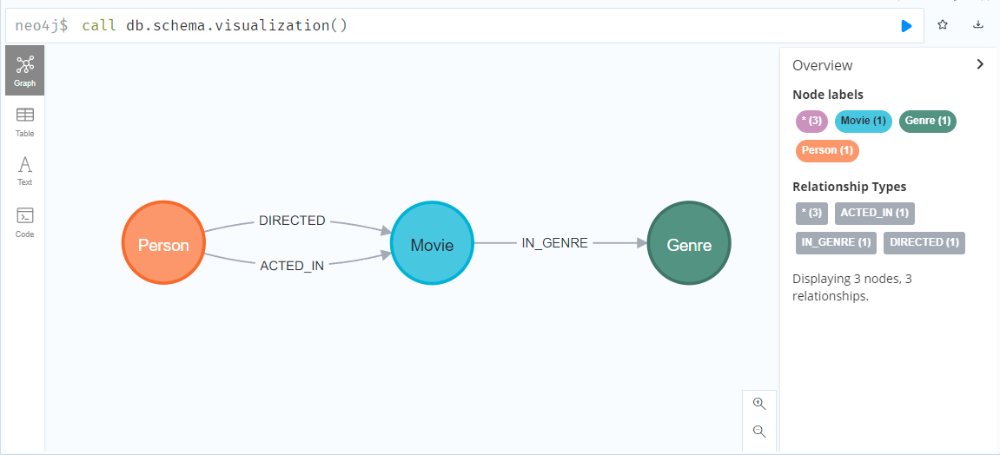

# Importing data from a CSV file

To import the dataset into the database, execute the following command. Don't worry, the command is explained on this page. Since the data import takes a few minutes to fully complete, you should start it now and then continue reading below.

```
LOAD CSV WITH HEADERS FROM 'file:///netflix_titles.csv' AS row
CREATE (movie:Movie {id: row.show_id, name: row.title, description: row.description, rating: row.rating})
WITH movie, row
UNWIND split(row.director, ',') AS dir
MERGE (director:Person {name: trim(dir)})
MERGE (director)-[:DIRECTED]->(movie)
WITH movie, row
UNWIND split(row.cast, ',') AS act
MERGE (actor:Person {name: trim(act)})
MERGE (actor)-[:ACTED_IN]->(movie)
WITH movie, row
UNWIND split(row.listed_in, ',') AS gen
MERGE (genre:Genre {name: trim(gen)})
MERGE (movie)-[:LISTED_IN]->(genre)
```{{execute}}


To understand what the above command does in detail, let's look at the different parts:

1. `LOAD CSV WITH HEADERS FROM 'file:///netflix_titles.csv' AS row` loads the CSV file from the /neo4j/data/ directory in the Docker container and parses the single lines. `AS row` saves the values of a single line in the variable `row` so we can access them in the rest of the query.

2. `CREATE (movie:Movie {id: row.show_id, name: row.title})` creates a single node with "Movie" label and sets some properties. 

3. `UNWIND split(row.director, ',') as d` splits a string containing multiple directors into single variables. This way, we can create a single node for each director.

4. `MERGE (director:Person {name: d})` creates a node with the "Person" label. However, different to the `CREATE`, `MERGE` checks if the node already exists. For instance, if the same person directs two movies, we only want to add a single node for that person. This is why `MERGE` is used here instead of `CREATE`.

5. `MERGE (director)-[:DIRECTED]->(movie)` creates a relationship between a single director node and the movie node that was created in bullet point 2. Like before, we use the `MERGE` command to only create the relationship if it does not exist. Therefore, we avoid duplicate relationships representing the same information.

The commands from 3, 4, and 5 are repeated to add nodes and relationships for the actors and genre of a movie. This is done for each line in the CSV file.

As a result, we have imported the data following the data model designed in step 2. Using Neo4j Browser User Interface allows generating a visualization of the database model. Since Katacoda is limited to a terminal, you can find output for the current database here:


