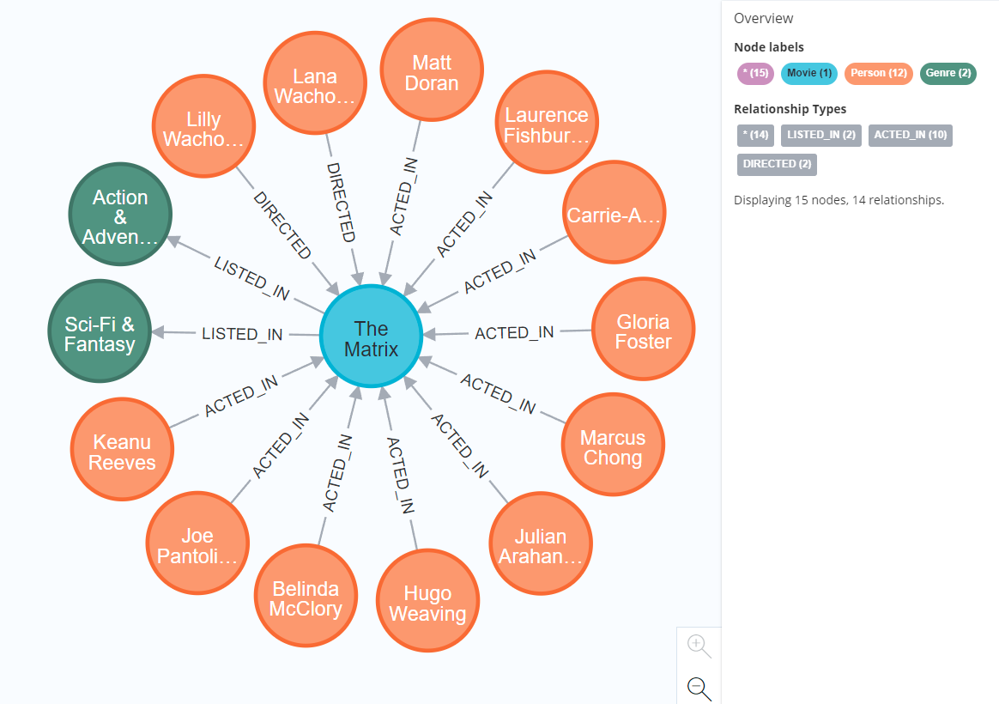

# Simple database queries

Now that the data is loaded, you can query the database using the Cypher Query Language (CQL).  

If you know the Structured Query Language (SQL), you might recognize some CQL clauses. Here is a short explanation of the clauses used in the example queries ("Cypher Query Language - Developer Guides", 2022):
- `MATCH` is used to search a specific pattern and to select nodes/relationships
- `RETURN` defines what data should be included in the query result
- `WHERE` adds a constraint or filter to the query
- `WITH` allows different query parts to be chained together
- `ORDER BY` is used to sort the results
- `LIMIT` constraints the number of results


Below are some example database queries. 


To check how many nodes of each label there are, you can execute the following command:  
```
MATCH (n) RETURN count(labels(n)), labels(n);
```{{execute}}
The database should contain 5990 movie nodes, 29792 unique persons (actors and directors), and 20 different genres.


Get information about the movie "The Matrix":  
```
MATCH (movie:Movie)-[relationship]-(node) 
WHERE movie.name = "The Matrix" 
RETURN movie.name, relationship, node.name
ORDER BY type(relationship);
```{{execute}}
The output of this query is probably confusing in the terminal. This is because the output is a graph and can not be visualized in the command line. Here is how the output looks using the Neo4j Browser User Interface:
 


Which Person has directed the most movies?
```
MATCH (director:Person)-[rel:DIRECTED]->(m:Movie)
WITH director, count(m) as total_movies
RETURN director.name, total_movies
ORDER BY total_movies DESC
LIMIT 5;
```{{execute}}

If you want to know more about the syntax of CQL and learn how to write your own queries, you check the official neo4j documentation [here](https://neo4j.com/developer/cypher/).